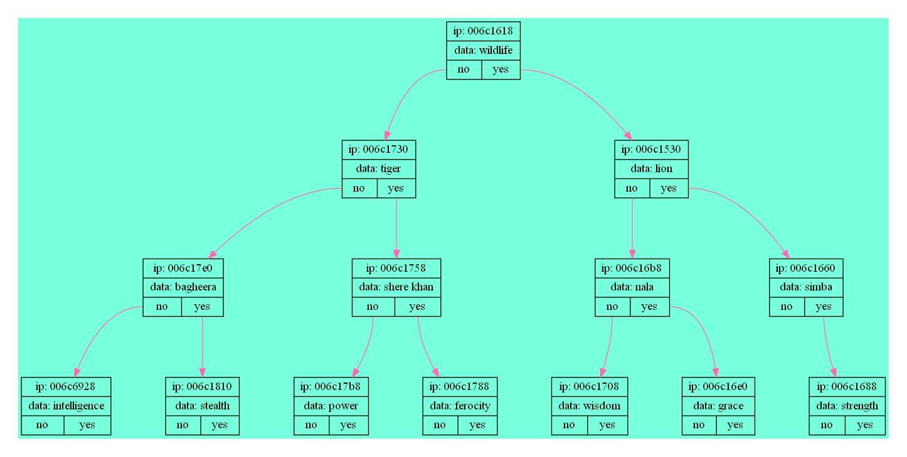

# Akinator-Style Guessing Game

A C program that mimics the Akinator game - it tries to guess what object or character you're thinking of by asking yes/no questions. The game learns new objects when it can't guess correctly.

## How It Works

The program uses a binary decision tree where:
- Each node contains a question
- "Yes" answers go to the left child node
- "No" answers go to the right child node
- Leaf nodes contain the final guesses

When the program fails to guess correctly, it asks for:
1. The name of the object you were thinking of
2. A question that would distinguish it from its incorrect guess
Then it adds these to its database.

## Features

- Three main modes:
  1. **Guess mode**: The classic Akinator experience
  2. **Definition mode**: Shows the path to any known object
  3. **Compare mode**: Finds similarities/differences between two objects

- Visual tree output (requires Graphviz):
  

- Saves and loads the knowledge base from files

## Building and Running

1. Make sure you have GCC and Make installed
2. Clone the repository:
   ```bash
   git clone https://github.com/NeIIor/akinator.git
   cd akinator
   ```
3. Compile with:
   ```bash
   make
   ```
4. Run the game:
   ```bash
   ./bin/akinator
   ```

## File Structure

The important files are:
- `src/akinator.c` - Main game logic
- `h/bin_tree.h` - Binary tree implementation
- `src/dump.c` - Code for visualizing the decision tree
- `data/` - Folder where game data is stored

## Customization

You can modify:
- `SIZE_ANSWER` in the code to change maximum answer length
- The initial database file to start with different questions
- The visualization colors in `dump.c`

## Known Limitations

- Currently uses console input/output only
- The text database format is somewhat fragile
- Large knowledge bases may slow down the program

The code should work on any system with a C compiler. Let me know if you run into any issues getting it to work.
